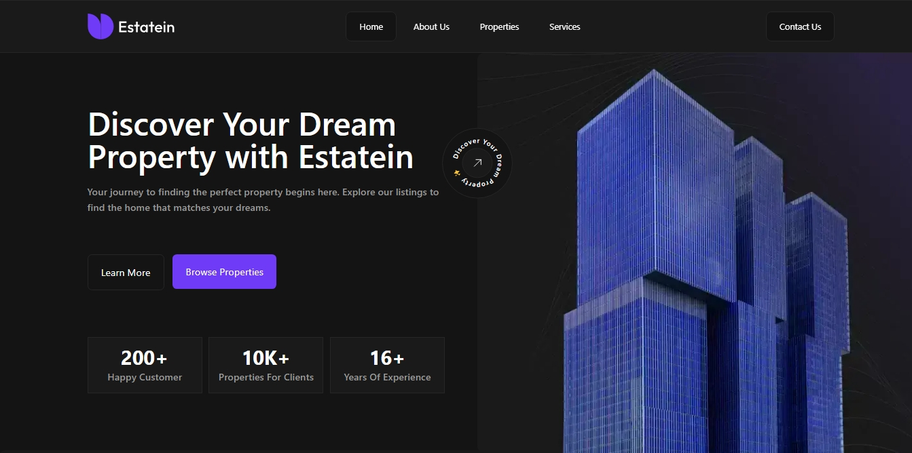

<div align="center">
  
  <p>Estatein</p>
</div>

# Estatein

A website for the real estate company Estatein, featuring information about the company such as its journey, achievements, clients, and properties.
It also includes a dashboard for employees to manage properties, client inquiries, and view statistics related to these, as well as newsletter subscriptions.



[Design on figma](https://www.figma.com/community/file/1314076616839640516) by [Produce-ui](https:///produce-ui.com)

## Built With

- [Next.js](https://https://nextjs.org)
- [TypeScript](https://www.typescriptlang.org/)
- [Prisma](https://https://www.prisma.io/)
- [Tailwind CSS](https://tailwindcss.com/)
- [Shadcn ui](https://ui.shadcn.com/)
- [React Hook Form](https://react-hook-form.com/)
- [Zod](https://zod.dev/)

## Live Demo

You can view a live demo hosted on [Vercel](https://vercel.com/):

https://estatein.abdalrhman.me

## Running Locally

1.  Clone the repository:

```
git clone https://github.com/Abdalrhman-Almarakeby/estatein.git
```

2.  Navigate to the project directory:

```
cd estatein
```

3.  Install dependencies:

```
npm install
```

4.  Start the local development server:

```
npm run dev
```

5.  Open [http://localhost:3000](http://localhost:3000/) in your browser.

## Contact

Github: [Abdalrhman Almarakeby](https://github.com/Abdalrhman-Almarakeby)

Linkedin :[Abdalrhman Almarakeby](https://www.linkedin.com/in/abdalrhman-almarakeby/)

Email: contact@abdalrhman.me
